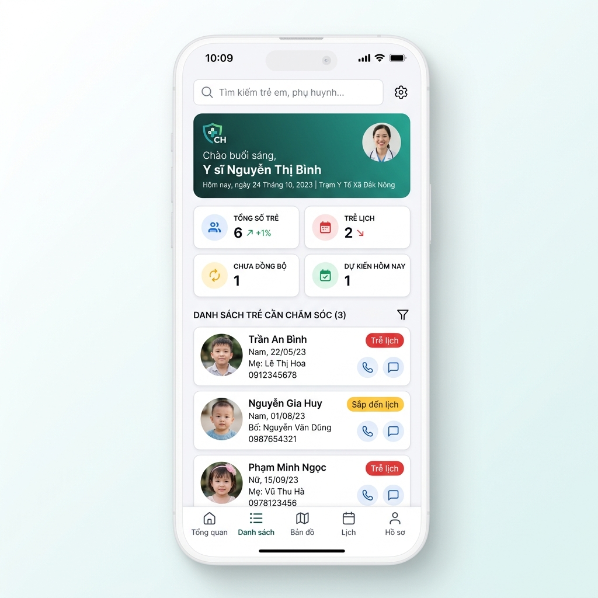
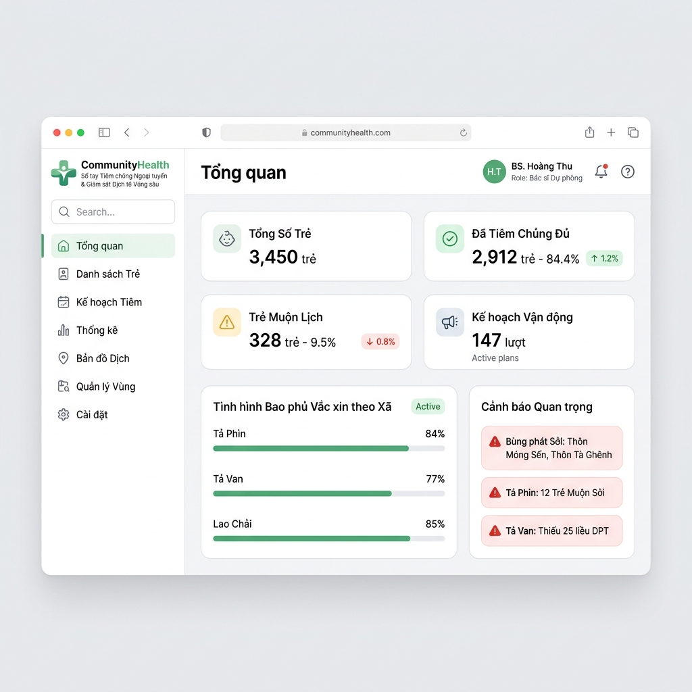

# BTL11 – Báo cáo Dự án CommunityHealth

Dự án bài tập lớn **BTL11 – CommunityHealth** phát triển ứng dụng di động và web hỗ trợ **Sổ tay tiêm chủng ngoại tuyến & Giám sát dịch tễ vùng sâu**.

---

## 1. TÊN DỰ ÁN
**BTL11 – CommunityHealth** (Sổ tay Tiêm chủng Ngoại tuyến & Giám sát Dịch tễ Vùng sâu)

---

## 2. GIỚI THIỆU COMMUNITYHEALTH
**CommunityHealth** là giải pháp phần mềm y tế cơ sở nhằm chuyển đổi số công tác tiêm chủng và giám sát dịch tễ tại các khu vực vùng sâu, vùng xa, nơi có kết nối internet không ổn định hoặc hoàn toàn ngoại tuyến. Hệ thống cho phép cán bộ y tế đi bản tra cứu, ghi nhận lịch sử tiêm chủng ngoại tuyến, tự động đồng bộ khi có kết nối trở lại, đồng thời cung cấp giao diện quản trị Web cho trung tâm y tế huyện theo dõi tỷ lệ bao phủ theo thời gian thực.

---

## 3. BÀI TOÁN CẦN GIẢI QUYẾT
*   **Thiếu kết nối mạng:** Cán bộ y tế khi đi tiêm chủng lưu động tại các bản làng vùng cao không thể truy cập các hệ thống trực tuyến.
*   **Trễ lịch tiêm chủng:** Trẻ em vùng sâu dễ bị bỏ sót các mũi tiêm cơ bản (BCG, DPT, Sởi) do phụ huynh không nhớ lịch hoặc cán bộ y tế khó quản lý danh sách.
*   **Dự trù vật tư thiếu chính xác:** Việc dự trù số lượng liều vaccine mang đi các buổi tiêm lưu động thường dựa trên phỏng đoán, dễ dẫn đến thiếu hụt hoặc lãng phí vaccine.
*   **Thu thập dữ liệu chậm:** Tỷ lệ phủ vaccine tại các xã được tổng hợp thủ công qua sổ sách giấy tờ, mất nhiều thời gian và dễ sai sót.

---

## 4. ĐỐI TƯỢNG SỬ DỤNG
1.  **Cán bộ y tế xã/bản (Mobile App):** Sử dụng thiết bị di động cá nhân để tìm kiếm thông tin trẻ, quét mã QR hồ sơ, ghi nhận mũi tiêm mới ngoại tuyến và đồng bộ dữ liệu.
2.  **Quản trị viên Trung tâm Y tế Huyện (Web Admin):** Theo dõi tỷ lệ phủ vaccine toàn huyện, quản lý danh mục lịch tiêm, lập kế hoạch và tính toán dự trù vaccine cho các chiến dịch tiêm lưu động tại các xã.

---

## 5. CÁC CHỨC NĂNG CHÍNH

### Phân hệ Mobile App (Cán bộ y tế xã)
*   **Đăng nhập ngoại tuyến:** Đăng nhập an toàn bằng dữ liệu đã lưu trong bộ nhớ cache của thiết bị.
*   **Quản lý danh sách trẻ em:** Tìm kiếm theo tên trẻ, tên mẹ hoặc quét mã QR demo. Hỗ trợ lọc danh sách theo thôn bản và trạng thái tiêm chủng.
*   **Hồ sơ tiêm chủng chi tiết:** Xem lịch sử các mũi đã tiêm (số lô, cán bộ tiêm, ngày tiêm, phản ứng phụ) và mũi tiêm dự kiến tiếp theo.
*   **Ghi nhận mũi tiêm mới:** Nhập thông tin mũi tiêm ngoại tuyến. Hệ thống tự động cảnh báo nếu chọn sai loại vaccine so với lịch đề xuất.
*   **Đồng bộ dữ liệu thủ công:** Mô phỏng kết nối mạng để tải lên các bản ghi chờ đồng bộ (`pending`) lên hệ thống quản trị huyện.

### Phân hệ Web Admin (Quản trị viên huyện)
*   **Dashboard tổng quan dịch tễ:** Thống kê tổng số trẻ, tỷ lệ bao phủ vaccine toàn huyện, số trẻ trễ lịch và số kế hoạch sắp tới.
*   **Theo dõi tỷ lệ bao phủ theo xã:** Bản đồ tỷ lệ dạng thanh tiến trình trực quan phân loại xanh (≥ 80%), vàng (60–79%), đỏ (< 60%). Xem chi tiết tỷ lệ từng loại vaccine (BCG, DPT1-3) của từng xã.
*   **Lập kế hoạch tiêm lưu động:** Tạo buổi tiêm chủng, tự động tính toán số liều vaccine tối thiểu cần mang đi dựa trên số lượng trẻ chưa tiêm đủ tại xã mục tiêu, cộng thêm tỷ lệ dự phòng hao hụt.
*   **Danh mục lịch vaccine chuẩn:** Quản lý độ tuổi tiêm và dung sai ngày tiêm tiêu chuẩn đối với từng loại vaccine.

---

## 6. CÔNG NGHỆ SỬ DỤNG
*   **Framework chính:** Flutter (SDK `>=3.4.0 <4.0.0`)
*   **Ngôn ngữ:** Dart
*   **Giao diện:** Material Design 3, phong cách thiết kế hiện đại (sleek green theme, card bo góc lớn, typography đồng nhất).
*   **Quản lý trạng thái:** `ChangeNotifier` kết hợp với `InheritedNotifier` (thông qua `AppScope`).
*   **Responsive Engine:** `LayoutBuilder`, `MediaQuery` và `NavigationRail` tự động điều chỉnh bố cục giữa Web/Tablet/Mobile.

---

## 7. CẤU TRÚC THƯ MỤC
```text
lib/
├── core/
│   └── constants/                 # Chứa các hằng số màu sắc và cấu hình hệ thống
├── data/
│   └── demo_data.dart             # Mock data của 6 trẻ, 6 xã và danh mục vaccine
├── models/
│   └── models.dart                # Khai báo các thực thể dữ liệu (ChildProfile, Record, vv.)
├── screens/
│   ├── admin/                     # Giao diện dành cho Web Admin
│   │   ├── admin_dashboard_screen.dart
│   │   ├── admin_shell.dart       # Bộ khung Web chứa NavigationRail
│   │   ├── coverage_screen.dart   # Thống kê tỷ lệ bao phủ vaccine theo xã
│   │   ├── plan_screen.dart       # Lập kế hoạch tiêm chủng lưu động
│   │   └── vaccine_catalog_screen.dart
│   ├── mobile/                    # Giao diện dành cho Mobile App
│   │   ├── child_detail_screen.dart
│   │   ├── children_screen.dart   # Tìm kiếm và lọc trẻ em
│   │   ├── home_screen.dart       # Trang chủ di động y sĩ
│   │   ├── mobile_shell.dart      # Bộ khung Mobile chứa BottomNavigationBar
│   │   ├── record_vaccination_screen.dart # Form ghi nhận tiêm chủng ngoại tuyến
│   │   ├── settings_screen.dart
│   │   └── sync_screen.dart       # Mô phỏng kết nối và đồng bộ
│   └── login_screen.dart          # Màn hình đăng nhập đa năng chuyển phân hệ
├── state/
│   └── app_store.dart             # Quản lý trạng thái lưu trữ cục bộ và đồng bộ
├── widgets/
│   └── common_widgets.dart        # Các thành phần dùng chung (SectionHeader, StatCard, vv.)
└── main.dart                      # Điểm khởi chạy ứng dụng
```

---

## 8. HÌNH ẢNH GIAO DIỆN MOBILE
Giao diện Mobile App mô phỏng kích thước `390 × 844 px`:
1.  **Đăng nhập:** Hộp thẻ Card màu trắng nổi bật trên nền xám nhạt `#F5F7F6`.
2.  **Trang chủ:** Thẻ Header Gradient màu xanh lá cây đậm `#167D5A` sang xanh nhạt, chứa lời chào y sĩ và nút tìm kiếm nhanh. Lưới Stat Cards 2x2 bo góc `20 px` thể hiện trực quan dữ liệu.
3.  **Hồ sơ chi tiết:** Thể hiện đầy đủ avatar bo tròn, trạng thái tiêm chủng thông qua `StatusPill` màu sắc nổi bật, danh sách các mũi tiêm dạng timeline ngược dòng thời gian.



---

## 9. HÌNH ẢNH GIAO DIỆN WEB
Giao diện Web Admin mô phỏng kích thước `1440 × 1024 px`:
1.  **Dashboard:** NavigationRail màu trắng tinh tế chiếm lề trái. Khu vực giữa hiển thị biểu đồ phần trăm tỷ lệ phủ vaccine của 6 xã huyện Sa Pa.
2.  **Tỷ lệ phủ:** Bảng số liệu chi tiết `DataTable` hỗ trợ cuộn ngang mượt mà khi cửa sổ trình duyệt bị thu nhỏ. Nhấn dòng xã hiện lên AlertDialog chứa chi tiết độ phủ của từng mũi vaccine.



---

## 10. FIGMA SPECIFICATION LINK
Đặc tả chi tiết hệ thống thiết kế và các màn hình Figma có thể được tham khảo trực tiếp tại:
[docs/FIGMA_SPEC.md](file:///d:/BTL_Community_Health_Demo/community_health_flutter/docs/FIGMA_SPEC.md)

---

## 11. HƯỚNG DẪN CÀI ĐẶT
1.  **Cài đặt Flutter SDK:** Đảm bảo máy đã cài đặt Flutter bản ổn định (stable channel, từ `3.24.0` trở lên).
2.  **Clone mã nguồn:**
    ```bash
    git clone https://github.com/Duckngunguk/BTL11_CommunityHealth.git
    cd BTL11_CommunityHealth/community_health_flutter
    ```
3.  **Tải các package phụ thuộc:**
    ```bash
    flutter pub get
    ```

---

## 12. HƯỚNG DẪN CHẠY ANDROID
Kết nối điện thoại Android hoặc mở phần mềm giả lập (Emulator), sau đó chạy lệnh:
```bash
flutter run
```

---

## 13. HƯỚNG DẪN CHẠY FLUTTER WEB
Để chạy thử phân hệ Web Admin và Mobile App trên trình duyệt Google Chrome:
```bash
flutter run -d chrome
```

---

## 14. HƯỚNG DẪN BUILD WEB
Để đóng gói ứng dụng phục vụ triển khai chạy thử trên hosting hoặc máy chủ web:
```bash
flutter clean
flutter pub get
flutter build web --release
```
Sản phẩm đầu ra nằm tại thư mục: `build/web/`

---

## 15. DANH SÁCH THÀNH VIÊN
*   **Thành viên 1 (Trưởng nhóm):** Đặng Huy Hoán – MSV: 2351170595 (GitHub: `danghoan66`)
*   **Thành viên 2:** Nguyễn Mạnh Đức – MSV: 2351160511 (GitHub: `Duckngunguk`)

---

## 16. BẢNG PHÂN CHIA NHIỆM VỤ

| Thành viên | MSV | Vai trò | Module | Công việc cụ thể | File/thư mục liên quan | Branch | Issue | Tiêu chí hoàn thành | Cách kiểm tra |
| :--- | :--- | :--- | :--- | :--- | :--- | :--- | :--- | :--- | :--- |
| **Đặng Huy Hoán** | 2351170595 | Trưởng nhóm | Hạt nhân & Web Admin | - Thiết kế màu sắc, theme, widgets dùng chung.<br>- Navigation và Routing.<br>- Phân hệ Admin Dashboard, Coverage, Plan, Vaccine Catalog.<br>- Kiểm duyệt code, viết kịch bản trình bày, README. | `lib/main.dart`<br>`lib/widgets/`<br>`lib/screens/admin/` | `feature/app-theme`<br>`feature/navigation`<br>`feature/main-screens`<br>`docs/readme` | #1, #2, #3, #4 | - Không còn lỗi cảnh báo analyze.<br>- Web Admin hiển thị mượt trên màn hình Desktop (Sidebar hoạt động). | `flutter analyze`<br>`flutter run -d chrome` |
| **Nguyễn Mạnh Đức** | 2351160511 | Thành viên | Phân hệ Mobile | - Hoàn thiện các trang Mobile App (Home, Children, Detail, Record, Sync, Settings).<br>- Tạo mock data chi tiết.<br>- Viết logic kiểm tra validation mẫu và trạng thái (Empty/Loading).<br>- Viết đặc tả Figma. | `lib/data/`<br>`lib/models/`<br>`lib/screens/mobile/`<br>`docs/FIGMA_SPEC.md` | `feature/form-validation`<br>`feature/mock-data`<br>`feature/flutter-web`<br>`docs/figma-spec` | #5, #6, #7, #8 | - Khắc phục hoàn toàn lỗi RenderFlex trên màn hình đăng nhập.<br>- Giao diện Mobile co giãn đúng tỷ lệ, không tràn chữ. | `flutter test`<br>`flutter run` (thu nhỏ cửa sổ) |

---

## 17. QUY TRÌNH LÀM VIỆC GITHUB
1.  Nhóm trưởng khởi tạo nhánh `develop` từ nhánh `main`.
2.  Mỗi thành viên tạo nhánh chức năng (`feature/...`) từ nhánh `develop`.
3.  Thành viên thực hiện thay đổi và commit code thường xuyên trên nhánh cá nhân.
4.  Khi hoàn thành, tạo Pull Request (PR) từ `feature/...` về `develop`.
5.  Trưởng nhóm kiểm duyệt mã nguồn (Review Code), giải quyết xung đột (conflict) nếu có và merge vào `develop`.
6.  Khi phiên bản chạy thử đạt độ ổn định cao nhất, merge từ `develop` vào nhánh `main` để chuẩn bị báo cáo giảng viên.

---

## 18. QUY TẮC NHÁNH (BRANCH RULES)
Cấu trúc đặt tên nhánh tuân thủ:
*   `main`: Nhánh chạy ổn định, sẵn sàng deploy demo.
*   `develop`: Nhánh tích hợp mã nguồn của cả hai thành viên.
*   `feature/<tên-chức-năng>`: Nhánh phát triển tính năng mới. (Ví dụ: `feature/app-theme`, `feature/form-validation`).
*   `fix/<tên-lỗi>`: Nhánh sửa các lỗi phát hiện khi chạy thử.
*   `docs/<tên-tài-liệu>`: Nhánh cập nhật tài liệu dự án.

---

## 19. QUY TẮC COMMIT (COMMIT RULES)
Sử dụng chuẩn **Conventional Commits**:
*   `feat(<scope>): <mô tả>`: Khi thêm chức năng mới. (Ví dụ: `feat(theme): add application color and typography system`).
*   `fix(<scope>): <mô tả>`: Khi sửa lỗi. (Ví dụ: `fix(layout): resolve overflow on small screens`).
*   `style(<scope>): <mô tả>`: Khi thay đổi giao diện, định dạng code mà không đổi logic.
*   `refactor(<scope>): <mô tả>`: Khi cấu trúc lại code.
*   `docs(<scope>): <mô tả>`: Khi viết tài liệu hướng dẫn.

---

## 20. TIẾN ĐỘ HIỆN TẠI
*   [x] Kiểm tra và tái cấu trúc mã nguồn.
*   [x] Sửa lỗi RenderFlex overflow màn hình Đăng nhập (Mã nguồn đã pass 100% test).
*   [x] Loại bỏ 4 cảnh báo cú pháp và thư viện cũ của Flutter SDK.
*   [x] Hoàn thiện giao diện co giãn Responsive cho Dialog tỷ lệ phủ vaccine.
*   [x] Tạo tài liệu đặc tả thiết kế Figma (`docs/FIGMA_SPEC.md`).
*   [x] Build Web chạy ổn định không lỗi đóng gói.
*   [x] Hoàn thiện bảng phân chia nhiệm vụ và kịch bản trình bày chi tiết.

---

## 21. CÁC CHỨC NĂNG SẼ PHÁT TRIỂN TIẾP
*   Tích hợp thư viện cơ sở dữ liệu ngoại tuyến SQLite (`sqflite`) hoặc Hive để lưu trữ vĩnh viễn dữ liệu hồ sơ trẻ tại local thiết bị di động.
*   Tích hợp camera hỗ trợ quét mã QR thật thông qua package `mobile_scanner`.
*   Tích hợp tự động kiểm tra trạng thái kết nối mạng qua `connectivity_plus` để kích hoạt chế độ tự động đồng bộ ngầm bằng `workmanager`.
*   Thiết lập máy chủ backend Node.js/Firebase và cơ sở dữ liệu Firestore để đồng bộ dữ liệu tiêm chủng thật giữa huyện và xã.

---

# 22. KỊCH BẢN TRÌNH BÀY (5–7 PHÚT)

### Phần 1: Đặng Huy Hoán trình bày (Nhóm trưởng) - Khoảng 3 phút
> **Lời thoại:**
> *"Kính chào thầy cô và các bạn. Hôm nay nhóm BTL11 xin đại diện trình bày dự án BTL11 – CommunityHealth. Dự án của chúng em được phát triển dựa trên khó khăn thực tiễn trong công tác quản lý tiêm chủng tại vùng sâu vùng xa, nơi hạ tầng mạng internet chưa ổn định. 
> Mục tiêu chính của dự án là xây dựng một sổ tay tiêm chủng hoạt động hoàn toàn ngoại tuyến cho cán bộ y tế bản, kết hợp trang dashboard giám sát tiến độ tiêm chủng theo thời gian thực cho Trung tâm Y tế Huyện.
> Em xin giới thiệu kiến trúc mã nguồn ứng dụng. Chúng em sử dụng Flutter với cơ chế quản lý trạng thái AppStore bằng InheritedNotifier. Toàn bộ giao diện được thiết kế theo chuẩn Material 3 với hệ màu xanh ngọc chủ đạo thân thiện.
> Bây giờ, em xin phép demo phân hệ Web Admin dành cho cán bộ cấp huyện. Trên màn hình trình duyệt Chrome [Chỉ vào màn hình Web], thầy cô có thể thấy Dashboard tổng hợp tỷ lệ bao phủ của 6 xã thuộc huyện Sa Pa. Xã nào có tỷ lệ tiêm đủ dưới 60% sẽ được hệ thống hiển thị màu đỏ cảnh báo.
> Khi em nhấn vào mục Tỷ lệ phủ và chọn xã Tả Phìn [Click chọn xã], một cửa sổ thông tin chi tiết hiện lên thể hiện tỷ lệ bao phủ từng loại vaccine BCG và DPT các mũi. Đặc biệt, tại trang 'Kế hoạch tiêm', hệ thống hỗ trợ tính toán tự động số lượng liều vaccine cần chuẩn bị dựa trên số trẻ trễ lịch ở xã đó, giúp tối ưu hóa khâu chuẩn bị vật tư.
> Về quy trình làm việc nhóm, chúng em phân nhánh nghiêm ngặt từ nhánh develop, sử dụng Conventional Commits để ghi nhận nhật ký phát triển và quản lý công việc qua GitHub Project Board như mô tả trong tài liệu README. Tiếp theo, thành viên Nguyễn Mạnh Đức sẽ trình bày phân hệ di động."*

### Phần 2: Nguyễn Mạnh Đức trình bày - Khoảng 3 phút
> **Lời thoại:**
> *"Chào thầy cô, em là Nguyễn Mạnh Đức. Sau đây em xin phép trình bày phân hệ Mobile App dành cho cán bộ y tế đi bản. Do cán bộ y tế di chuyển nhiều nơi không có mạng, giao diện Mobile được tối ưu cho màn hình một cột nhỏ gọn [Show giao diện di động hoặc thu nhỏ trình duyệt].
> Tại màn hình Trang chủ di động, y sĩ Lê Thu có thể nhìn thấy ngay số trẻ trễ lịch và số lượng bản ghi đang chờ đồng bộ lên hệ thống huyện. Khi chuyển qua danh sách Trẻ em, cán bộ có thể tìm kiếm nhanh hoặc bấm quét mã QR để truy cập trực tiếp Hồ sơ tiêm chủng của bé [Click vào bé Nguyễn Minh An].
> Tại đây, lịch sử tiêm chi tiết được hiển thị rất rõ ràng. Để ghi nhận một mũi tiêm mới, y sĩ ấn nút 'Ghi nhận mũi tiêm mới' [Click nút]. Hệ thống có tính năng kiểm tra lỗi: ví dụ nếu bé cần tiêm DPT nhưng cán bộ chọn nhầm Sởi, một cảnh báo cảnh báo sẽ xuất hiện để ngăn ngừa sai sót y tế. Sau khi lưu, bản ghi sẽ có trạng thái 'Chờ đồng bộ' (pending).
> Khi có Wi-Fi hoặc 4G, cán bộ y tế vào trang 'Đồng bộ' và nhấn nút 'Đồng bộ ngay' [Click nút đồng bộ]. Dữ liệu sẽ lập tức được đẩy lên máy chủ huyện và cập nhật trạng thái đã đồng bộ thành công.
> Để chứng minh ứng dụng chạy mượt mà trên nhiều kích thước màn hình, em xin co giãn cửa sổ trình duyệt [Thu nhỏ / phóng to cửa sổ]. Thầy cô thấy giao diện tự động chuyển đổi từ dạng sidebar của Web sang dạng Bottom Navigation tiện lợi của điện thoại, hoàn toàn không xảy ra lỗi tràn giao diện RenderFlex.
> Cuối cùng, em xin chiếu qua đặc tả Figma tại docs/FIGMA_SPEC.md [Show tài liệu]. Chúng em đã quy định chính xác mã màu HEX, kích thước typography, hệ thống khoảng cách 8px và các component mẫu phục vụ cho việc bàn giao thiết kế. Cảm ơn thầy cô đã lắng nghe."*
